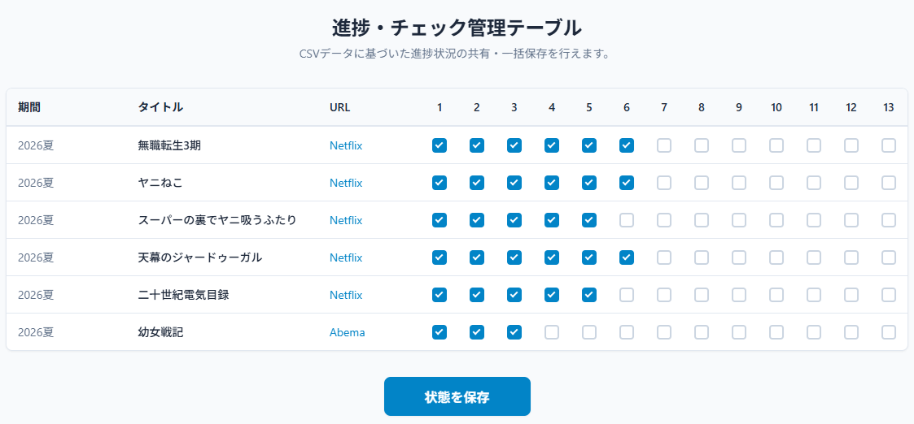
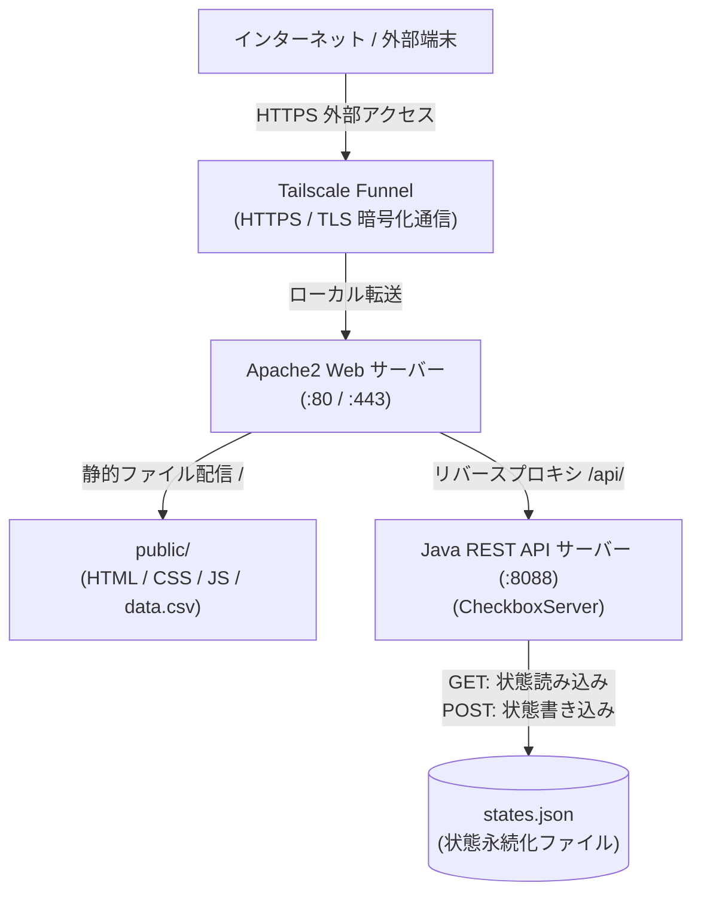

# CSV Checkbox Manager

CSVベースのデータ管理と複数ユーザー間でのチェックボックス進捗状態のリアルタイム共有・永続化を行うWebアプリケーションです。



Debian環境の自宅サーバーでの運用を想定し、**Java標準ライブラリのみで構成された軽量バックエンド**、**Apache2リバースプロキシ**、および**Tailscale Funnel**によるセキュアなインターネット公開アーキテクチャを採用しています。

---

## システムアーキテクチャ



---

## 必要要件

- **OS:** Debian GNU/Linux 11 (Bullseye) / 12 (Bookworm) 以降
- **Java:** OpenJDK 17 以降（標準ライブラリのみ使用）
- **Webサーバー:** Apache2 (`mod_proxy`, `mod_proxy_http` 有効)
- **公開ツール:** Tailscale (Funnel機能を使用)

---

## ディレクトリ構成

```text
csv-checkbox-manager/
├── .gitignore
├── README.md
├── data.csv.example            # CSVサンプルデータ
├── states.json                 # チェック状態の永続化ファイル（POST時に自動生成）
├── public/                     # Apache2で配信する静的公開ディレクトリ
│   ├── index.html              # フロントエンドHTML
│   ├── css/
│   │   └── style.css           # スタイル定義
│   ├── js/
│   │   └── app.js              # フロントエンドロジック (定数・通信・描画)
│   └── data.csv                # 実際のデータ（data.csv.exampleから作成）
└── server/
    └── CheckboxServer.java     # Java標準HttpServerベースのREST API
```

---

## セットアップ手順

### 1. 必要パッケージのインストール

Debian環境で必要なパッケージをインストールします。

```bash
sudo apt update
sudo apt install -y openjdk-17-jdk apache2 git
```

### 2. リポジトリの配置

任意のディレクトリ（例: `/var/www/csv-checkbox-manager` または `/mnt/ssd/html/csv-checkbox-manager`）に配置します。

```bash
# 作業ディレクトリの例
cd /var/www/csv-checkbox-manager
```

### 3. CSVファイルの配置

サンプルファイルを元に、実際のデータを配置します。

```bash
cp data.csv.example public/data.csv
```

> **CSVフォーマット:**
> 1行目はヘッダー、2行目以降は `期間,タイトル,URLのテキスト,URLのリンク` の順に記述します。
> ```csv
> 期間,タイトル,URLのテキスト,URLのリンク
> 2026/04-2026/06,第1四半期システム点検,点検チェックリスト,https://example.com/docs/q1
> ```

### 4. Javaバックエンドのコンパイル

```bash
# プロジェクトルートディレクトリで実行
javac server/CheckboxServer.java
```

---

## systemd によるバックエンド常時起動 & 自動起動設定

バックエンドサーバーをデーモンとして常時稼働させるため、`systemd` サービスを作成します。

### 1. サービスファイルの作成

`/etc/systemd/system/checkbox-server.service` を作成します。

```ini
[Unit]
Description=CSV Checkbox Manager Java Backend Service
After=network.target

[Service]
Type=simple
User=www-data
Group=www-data
# プロジェクトの配置パスに合わせて変更してください
WorkingDirectory=/var/www/csv-checkbox-manager
ExecStart=/usr/bin/java -cp . server.CheckboxServer
Restart=always
RestartSec=5

# セキュリティ強化設定
NoNewPrivileges=true
PrivateTmp=true

[Install]
WantedBy=multi-user.target
```

### 2. パーミッションの設定とサービスの起動

バックエンドが `states.json` を読み書きできるよう、実行ユーザー（`www-data`）に書き込み権限を付与します。

```bash
# ディレクトリ所有者を www-data に変更
sudo chown -R www-data:www-data /var/www/csv-checkbox-manager

# systemd デーモンのリロードと起動・自動起動の有効化
sudo systemctl daemon-reload
sudo systemctl enable --now checkbox-server

# 稼働状況の確認
sudo systemctl status checkbox-server
```

---

## Apache2 のリバースプロキシ & 静的配信設定

Apache2でフロントエンド（`public/`）を配信し、`/api/` へのリクエストをJavaバックエンドサーバー（`http://127.0.0.1:8088/api/`）へ転送します。

### 1. 必要なApacheモジュールの有効化

```bash
sudo a2enmod proxy proxy_http rewrite headers
```

### 2. リバースプロキシ設定の追加

既存のVirtualHost設定ファイル（例: `/etc/apache2/sites-available/000-default.conf`）内の `<VirtualHost *:80>` に以下のリバースプロキシ設定を追加します。

```apache
    # APIリクエストをJavaバックエンドにリバースプロキシ
    ProxyPreserveHost On
    ProxyPass /api/ http://127.0.0.1:8088/api/
    ProxyPassReverse /api/ http://127.0.0.1:8088/api/
```

### 3. 設定の適用とApache2の再読み込み

```bash
sudo apache2ctl configtest
sudo systemctl reload apache2
```

---

## Tailscale Funnel による安全な外部公開手順

自宅サーバーのルーターのポート開放（ポートフォワーディング）を行うことなく、Tailscale Funnelを用いて安全に外部インターネットへ公開します。

### 1. Tailscale のインストールとログイン

```bash
# Tailscaleの公式スクリプトでインストール
curl -fsSL https://tailscale.com/install.sh | sh

# Tailscaleにログイン（Funnel機能が有効なアカウント）
sudo tailscale up
```

### 2. Tailscale Funnel の有効化

Apache2（ポート80）への通信をTailscale Funnel経由でHTTPS外部公開します。

```bash
# ポート80で稼働中のWebサーバーをHTTPS (ポート443) として外部公開
sudo tailscale funnel 80
```

> **確認方法:**
> ```bash
> tailscale funnel status
> ```
> コマンド実行後に表示されるURL（例: `https://<node-name>.<tailnet-name>.ts.net`）へスマートフォン等の外部ネットワーク端末からアクセスすることで、安全に利用できます。

---

## 設定変更ガイド

### 列数（チェックボックス数）の変更
テーブル右側に表示するチェックボックスの列数は、`public/js/app.js` の冒頭定数で簡単に変更可能です。

```javascript
// public/js/app.js
const COLUMN_COUNT = 13; // 任意の列数に変更（例: 10, 20 など）
```
変更後はブラウザをリロードするだけで即座に反映されます。

### ポート番号やバインドIPの変更
Javaバックエンドのポート等を変更する場合は、`server/CheckboxServer.java` の定数および Apache2 の `ProxyPass` 設定を修正してください。

```java
// server/CheckboxServer.java
public static final String HOST = "127.0.0.1";
public static final int PORT = 8088;
```

---

## ライセンス
MIT License
